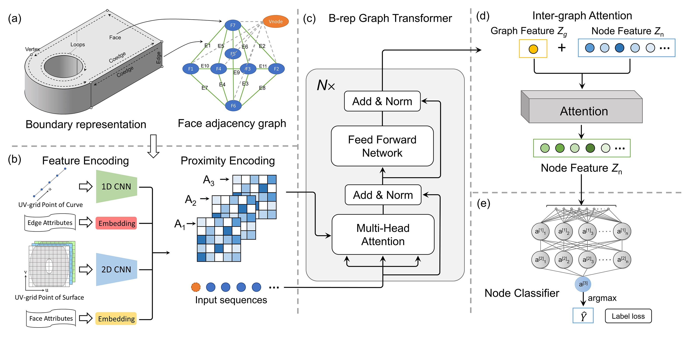

# BrepMFR

Code for BrepMFR: Enhancing machining feature recognition in B-rep models through deep learning and domain adaptation.



## About BrepMFR

BrepMFR, a novel deep learning network designed for machining feature recognition on B-rep models within the CAD/CAM domain. The original B-rep model is converted into a graph representation for network-friendly input, where graph nodes and edges respectively correspond to faces and edges of the original model. Subsequently, we leverage a graph neural network based on the Transformer architecture and graph attention mechanism to encode both local geometric shape and global topological relationships, achieving high-level semantic extraction and prediction of machining feature categories. Furthermore, to enhance the performance of neural networks on real-world CAD models, we adopt a two-step training strategy within a novel transfer learning framework.

## Preparation

### Environment Setup

There are two conda environments available:

| Environment | File | Python | PyTorch | CUDA | pythonocc | Use case |
|---|---|---|---|---|---|---|
| `brep_mfr` | `environment.yml` | 3.9 | 1.13 | 11.7 | 7.9.0 | Legacy: original BrepMFR model (`models/`) with DGL + fairseq |
| `new_brepmfr` | `modern_environment.yml` | 3.11 | 2.5+ | 12.1 | 7.9+ | Modern: BrepFormer (`brepformer/`), defeaturing v2, new development |

#### Option A: Modern environment (recommended for new work)

```bash
# One-step setup via script
./scripts/setup_env.sh

# Or manually
conda env create -f modern_environment.yml
conda activate new_brepmfr
```

#### Option B: Legacy environment (for original BrepMFR model)

```bash
conda env create -f environment.yml
conda activate brep_mfr
```

#### Environment management scripts

```bash
# Create the new_brepmfr environment
./scripts/setup_env.sh

# Check if environment exists and show key packages
./scripts/setup_env.sh --check

# Update existing environment from yml
./scripts/setup_env.sh --update

# Remove and recreate from scratch
./scripts/setup_env.sh --force

# Activate the environment (must be sourced)
source scripts/activate_env.sh
```

### Data preparation

Our synthetic CAD datasets have been publicly available on [Science Data Bank](https://www.scidb.cn/en/detail?dataSetId=931c088fd44f4d3e82891a5180f10d90)

The dataset directory should contain:
- `train.txt`, `val.txt`, `test.txt` - Text files listing the file stems (one per line)
- `.bin` files - Graph data files (can be in subdirectories)

Example dataset structure:
```
dataset/
├── train.txt
├── val.txt
├── test.txt
└── 000bin/
    ├── 00001234/
    │   └── 00001234_abc123_trimesh_000.bin
    └── ...
```

## Training

### Using the Compatibility Wrapper (Recommended)

The wrapper script (`train_wrapper.py`) provides compatibility with newer versions of NumPy (1.24+) and PyTorch Lightning (2.x):

```bash
python train_wrapper.py train --dataset_path /path/to/dataset --max_epochs 100 --batch_size 64
```

#### Wrapper Arguments

| Argument | Default | Description |
|----------|---------|-------------|
| `--dataset_path` | (required) | Path to the dataset directory |
| `--max_epochs` | 100 | Maximum number of training epochs |
| `--batch_size` | 64 | Batch size for training |
| `--num_workers` | 12 | Number of data loader workers (set to 0 on Windows) |
| `--num_classes` | 25 | Number of feature classes |
| `--experiment_name` | BrepMFR | Experiment name (creates folder in `results/`) |
| `--devices` | 1 | Number of GPUs to use |
| `--gradient_clip_val` | 1.0 | Gradient clipping value |
| `--dropout` | 0.3 | Dropout rate |
| `--d_model` | 512 | Transformer model dimension |
| `--n_heads` | 32 | Number of attention heads |
| `--n_layers_encode` | 8 | Number of encoder layers |

### Using the Original Script

For older environments (NumPy < 1.24, PyTorch Lightning 1.x):

```bash
python segmentation.py train --dataset_path /path/to/dataset --max_epochs 1000 --batch_size 64
```

### Monitoring Training

The logs and checkpoints will be stored in a folder called `results/BrepMFR` based on the experiment name and timestamp, and can be monitored with Tensorboard:

```bash
tensorboard --logdir results/<experiment_name>
```

## Testing

### Using the Compatibility Wrapper (Recommended)

```bash
python train_wrapper.py test --dataset_path /path/to/dataset --checkpoint ./results/BrepMFR/<date>/<time>/best.ckpt --batch_size 64
```

### Using the Original Script

```bash
python segmentation.py test --dataset_path /path/to/dataset --checkpoint ./results/BrepMFR/best.ckpt --batch_size 64
```

## Compatibility Notes

The `train_wrapper.py` script addresses the following compatibility issues:

1. **NumPy 1.24+**: The deprecated `np.int`, `np.float`, and `np.bool` aliases were removed. The wrapper adds these aliases back automatically.

2. **PyTorch Lightning 2.x**: Several API changes were made:
   - `training_epoch_end` → `on_train_epoch_end`
   - `validation_epoch_end` → `on_validation_epoch_end`
   - `test_epoch_end` → `on_test_epoch_end`
   - `Trainer.from_argparse_args()` deprecated
   - `auto_select_gpus` argument removed

---

## BrepFormer: Automatic Defeaturing

The defeaturing pipeline classifies each face of a B-rep STEP model as random (stock), hole, chamfer, fillet, or cut, then removes all detected manufacturing features using OpenCASCADE's `BRepAlgoAPI_Defeaturing`, leaving only the base stock shape.

Two engine versions are available:

| Engine | Module | Requires | Status |
|---|---|---|---|
| **v2** (recommended) | `brepformer.defeature_v2` | pythonocc >= 7.9 | Modern engine with adaptive tolerance and enhanced healing |
| v1 | `brepformer.defeature` | pythonocc >= 7.5 | Original 5-phase progressive engine |

### Quick Start

```bash
# Activate modern environment
source scripts/activate_env.sh

# Defeature a single file (v2 engine, default)
./scripts/run_defeature.sh --step model.step

# Defeature a directory
./scripts/run_defeature.sh --step_dir steps/ --verbose

# Use v1 engine explicitly
./scripts/run_defeature.sh --engine v1 --step model.step
```

Or call the Python modules directly:

```bash
# v2 engine
python -m brepformer.defeature_v2 --step model.step

# v1 engine
python -m brepformer.defeature --step model.step

# Custom checkpoint and output
python -m brepformer.defeature_v2 --step model.step \
    --checkpoint results/my_model/best.ckpt \
    --output_dir output/
```

### Defeature v2 Engine — What's New

`defeature_v2.py` is a drop-in replacement for the original `defeature.py` with the same CLI interface. It targets the core limitation of v1 — faces that fail to remove due to borderline geometry tolerance — by adding six improvements:

#### 1. Adaptive Fuzzy Tolerance

When defeaturing fails at the default geometric tolerance (~1e-7), v2 automatically retries with progressively relaxed `SetFuzzyValue()`:

```
Tolerance ladder: 0 (default) → 1e-5 → 5e-5 → 1e-4 → 5e-4 → 1e-3
```

This is the single biggest improvement. Fillet faces that blend two non-planar surfaces often fail at tight tolerance because the gap-healing algorithm cannot close the intersection precisely enough. Relaxing by even 1e-5 is often sufficient.

The maximum tolerance is configurable:

```bash
# Allow up to 0.01 tolerance for very difficult models
python -m brepformer.defeature_v2 --step model.step --max_fuzzy 0.01
```

#### 2. History-Based Face Tracking

v1 uses `IndexedMap.Contains()` to check if an original face still exists in the modified shape between phases. This is fragile — when defeaturing modifies adjacent faces (extending them to fill gaps), the modified face has different identity from the original.

v2 uses `BRepTools_History` returned by the OCCT kernel (available since OCCT 7.4):
- `history.IsRemoved(face)` — was this face removed (directly or as side-effect)?
- `history.Modified(face)` — was this face reshaped? Returns the new version.

This precisely tracks what happened to every face, eliminating "lost face" bugs between phases.

#### 3. Pre-Validation and Auto-Repair

Before any defeaturing attempt, v2 validates the input shape with `BRepCheck_Analyzer`. If issues are found:
1. `ShapeFix_ShapeTolerance.LimitTolerance()` harmonizes face/edge tolerances to a sane range (1e-7 to 1e-3)
2. `ShapeFix_Shape.Perform()` fixes degenerate edges, bad wires, and face issues

Corrupted input geometry is a silent source of defeaturing failures. Pre-repair prevents them.

#### 4. Enhanced Healing Pipeline

After defeaturing, v2 runs a multi-stage repair chain instead of just `ShapeFix_Shape` + `UnifySameDomain`:

1. **Tolerance harmonization** — `ShapeFix_ShapeTolerance.LimitTolerance()` caps face/edge tolerances
2. **General shape fix** — `ShapeFix_Shape.Perform()` with configurable precision
3. **Conditional sewing** — `BRepBuilderAPI_Sewing` closes microscopic gaps (only runs if shape is invalid after step 2)
4. **Face unification** — `ShapeUpgrade_UnifySameDomain` with angular tolerance (1e-3 rad, ~0.06 degrees) and linear tolerance (1e-5, 10 microns) for merging nearly-coplanar faces that v1 would leave split

#### 5. Area-Based Ordering

Connected-component groups and individual retry faces are sorted by total surface area (smallest first). Smaller features have higher first-attempt success rates, and their removal often changes the topology enough to unblock adjacent larger features that previously failed.

#### 6. Intermediate Healing

In the single-face iterative phase (Phase 5c), v2 runs a quick `UnifySameDomain` pass after each successful removal. This improves geometry quality before the next attempt, cascading more successes.

### v2 CLI Reference

```bash
python -m brepformer.defeature_v2 [args]
```

| Argument | Default | Description |
|----------|---------|-------------|
| `--step` | None | Path to a single STEP file |
| `--step_dir` | None | Directory of STEP files (batch mode) |
| `--checkpoint` | `results/trial1_ss1500/best-epoch=57-val/f1=0.9415.ckpt` | Model checkpoint (must have face segmentation head) |
| `--seg` | None | Path to .seg file with pre-computed predictions (single mode) |
| `--seg_dir` | None | Directory of .seg prediction files (batch mode) |
| `--output_dir` | `brepformer/defeatured_output` | Output directory for defeatured STEP files |
| `--save_colored` | False | Also save a colored STEP showing predictions before defeaturing |
| `--verbose` | False | Print detailed per-phase defeaturing progress |
| `--max_fuzzy` | `1e-3` | Maximum fuzzy tolerance for adaptive retry (v2 only) |

### v2 Phase Algorithm

```
Phase 0 — Pre-validate input shape (auto-repair if needed)
Phase 1 — Try ALL features at once (adaptive tolerance: 0 → 1e-5 → ... → 1e-3)
Phase 2 — Progressive type-by-type: fillet → chamfer → hole → cut (adaptive)
Phase 3 — Connected components per failed type (area-sorted, adaptive)
Phase 4 — Retry remaining on modified shape (history-based face tracking, adaptive)
Phase 5 — Last-ditch fallbacks:
  5a. Fillets only → then remaining types
  5b. Reverse order (cut → hole → chamfer → fillet)
  5c. Single-face iterative (area-sorted, adaptive, intermediate healing)
Cleanup — Multi-stage healing: tolerance harmonization → shape fix → sewing → face unification
```

### Output Structure

```
brepformer/defeatured_output/
├── model_id_defeatured.step    # Defeatured STEP file (stock shape)
├── model_id_colored.step       # Colored predictions (if --save_colored)
├── model_id_report.json        # Per-model defeaturing report
└── batch_report.json           # Batch summary (batch mode only)
```

**Report JSON fields:**

| Field | Description |
|-------|-------------|
| `status` | `"success"`, `"no_features"`, or `"error"` |
| `num_faces` | Total faces in input model |
| `kept` | Faces classified as random (kept) |
| `removed` | Feature faces successfully removed |
| `failed` | Feature faces that could not be removed |
| `valid` | Whether the output shape passes BRepCheck validation |
| `elapsed_s` | Defeaturing time in seconds (v2 only) |

### Usage Examples

```bash
# ─── Single file ─────────────────────────────────────────────
# v2 engine with default checkpoint
./scripts/run_defeature.sh --step model.step

# Verbose output showing all phases
./scripts/run_defeature.sh --step model.step --verbose

# Higher tolerance for a difficult model with complex fillets
./scripts/run_defeature.sh --step complex_model.step --max_fuzzy 0.01 --verbose

# Also save colored STEP for visual comparison in FreeCAD
./scripts/run_defeature.sh --step model.step --save_colored

# Custom checkpoint
./scripts/run_defeature.sh --step model.step \
    --checkpoint "results/trial1_ss1500/best-epoch=57-val/f1=0.9415.ckpt"

# From pre-computed .seg predictions (skip inference, faster)
./scripts/run_defeature.sh --step model.step --seg preds.seg

# ─── Batch mode ──────────────────────────────────────────────
# Defeature all STEP files in a directory
./scripts/run_defeature.sh --step_dir brepformer/data/defeature/steps/

# Batch with pre-computed predictions
./scripts/run_defeature.sh --step_dir brepformer/data/defeature/steps/ \
    --seg_dir inference/trial1_ss1500/

# Batch with custom output directory and colored STEPs
./scripts/run_defeature.sh --step_dir steps/ \
    --output_dir my_output/ --save_colored --verbose

# ─── Engine comparison ───────────────────────────────────────
# Use the original v1 engine
./scripts/run_defeature.sh --engine v1 --step model.step --verbose

# v2 engine (default)
./scripts/run_defeature.sh --engine v2 --step model.step --verbose

# ─── Full pipeline: inference + defeature ────────────────────
# Step 1: Run inference
python -m brepformer.infer \
    --step_dir brepformer/data/defeature/steps/ \
    --checkpoint "results/trial1_ss1500/best-epoch=57-val/f1=0.9415.ckpt" \
    --output_dir inference/trial1_ss1500/

# Step 2: Defeature using inference results
./scripts/run_defeature.sh --step_dir brepformer/data/defeature/steps/ \
    --seg_dir inference/trial1_ss1500/ \
    --output_dir brepformer/defeatured_output/ \
    --save_colored --verbose

# Or combine inference + defeaturing in one command (runs model internally)
./scripts/run_defeature.sh --step_dir brepformer/data/defeature/steps/ \
    --checkpoint "results/trial1_ss1500/best-epoch=57-val/f1=0.9415.ckpt" \
    --output_dir brepformer/defeatured_output/
```

### Verbose Output Example (v2)

```
Defeaturing model.step (v2 engine)...
  Predictions (156 faces):
    random: 42 [keep]
    hole: 28 [REMOVE]
    chamfer: 8 [REMOVE]
    fillet: 52 [REMOVE]
    cut: 26 [REMOVE]
  Faces: 156 total, 42 random, 114 features
    fillet: 52
    chamfer: 8
    hole: 28
    cut: 26
    Phase 1 failed (114 faces), trying progressive...
    Phase 2 + fillet: all 52 faces (total: 52)
    Phase 2 + chamfer: all 8 faces (total: 60)
    Phase 3 hole: 28 faces in 6 groups (sizes: [2, 2, 4, 4, 8, 8])
      + group of 2 hole faces
      + group of 2 hole faces
      + group of 4 hole faces
      + group of 4 hole faces
      + group of 8 hole faces
        (succeeded at fuzzy=1e-05)
      + group of 8 hole faces
      hole: 28/28 removed
    Phase 2 + cut: all 26 faces (total: 114)

  Removed 114 feature faces (failed: 0)
  Shape valid: True
  Time: 4.21s
  Output: brepformer/defeatured_output/model_defeatured.step
```

### Known Limitation: Fillet Removal

`BRepAlgoAPI_Defeaturing` removes faces by extending adjacent faces to fill the gap — it does not simply delete geometry. This is robust for holes, chamfers, and cuts, but **fillets can be challenging**:

- Fillets that blend two non-planar surfaces at complex topology may fail because the healing kernel cannot compute the intersection of the extended surfaces.
- v2's adaptive tolerance resolves most of these cases by allowing slightly larger geometric gaps.
- In the remaining worst case, the face is left in place and counted as `failed` in the report.
- Processing time scales non-linearly for models with many interdependent fillets (300+ faces with many fillets can take several minutes).

### Test Results: Top 50 Largest Models

The pipeline was tested on the 50 models with the most faces from the defeature dataset (range: 242-1395 faces). All 50 completed successfully with **0 faces failing to remove** and **all output shapes valid**.

Results for the 23 models with detailed stats:

| Model | Faces | Kept | Removed | Failed | Valid | Feature% |
|---|---:|---:|---:|---:|---:|---:|
| uh62382 | 1395 | 952 | 443 | 0 | Y | 31% |
| plaque_tubulaire | 808 | 4 | 804 | 0 | Y | 99% |
| chicane | 756 | 6 | 750 | 0 | Y | 99% |
| TeaCoaster | 594 | 6 | 588 | 0 | Y | 98% |
| SWP-10017_modified | 384 | 70 | 314 | 0 | Y | 81% |
| Complex_Sheet_Metal_Part | 370 | 166 | 204 | 0 | Y | 55% |
| gear-_caddy | 357 | 199 | 158 | 0 | Y | 44% |
| DDLLINCGD0103 | 331 | 22 | 309 | 0 | Y | 93% |
| uh68595 | 326 | 10 | 316 | 0 | Y | 96% |
| gu100067 | 314 | 55 | 259 | 0 | Y | 82% |
| h00301-0002_reva_1_1 | 300 | 102 | 198 | 0 | Y | 66% |
| Ryan_Blystone (Roll Top Track Mount) | 293 | 23 | 270 | 0 | Y | 92% |
| MLLANINGD0781 | 292 | 75 | 217 | 0 | Y | 74% |
| VBP31-F103-R100-N50-001 | 284 | 132 | 152 | 0 | Y | 53% |
| schaal_d131_25-55g | 283 | 35 | 248 | 0 | Y | 87% |
| p-p017 | 278 | 4 | 274 | 0 | Y | 98% |
| SWP-08186 | 274 | 21 | 253 | 0 | Y | 92% |
| EMI_shielding_case | 268 | 38 | 230 | 0 | Y | 85% |
| ib_ob_item_120x80_item_120_x_80 | 264 | 14 | 250 | 0 | Y | 94% |
| hbld01062706 | 257 | 26 | 231 | 0 | Y | 89% |
| sv3307_1_1 | 254 | 144 | 110 | 0 | Y | 43% |
| DDLLINCGD0012 | 247 | 37 | 210 | 0 | Y | 85% |
| swing_check_valve_fl_-_150-2500 | 246 | 197 | 49 | 0 | Y | 19% |

**Batch 2 total: 6,837 feature faces removed, 0 failed, 23/23 valid shapes.**

The remaining 27 models (sizes 242-1077 faces) also all completed with no errors. One OCC segfault occurred at the OS/WSL2 level between the two batches (not a defeaturing failure) and did not affect any output files.

---

## Scripts Reference

All helper scripts are in the `scripts/` directory.

| Script | Usage | Description |
|---|---|---|
| `scripts/setup_env.sh` | `./scripts/setup_env.sh` | Create/update/check the `new_brepmfr` conda environment |
| `scripts/activate_env.sh` | `source scripts/activate_env.sh` | Activate `new_brepmfr` and print version info |
| `scripts/run_defeature.sh` | `./scripts/run_defeature.sh --step model.step` | Run defeaturing (v1 or v2 engine) |

For the full BrepFormer scripts reference (training, testing, inference, analysis, visualization), see [brepformer/SCRIPTS.md](brepformer/SCRIPTS.md).
